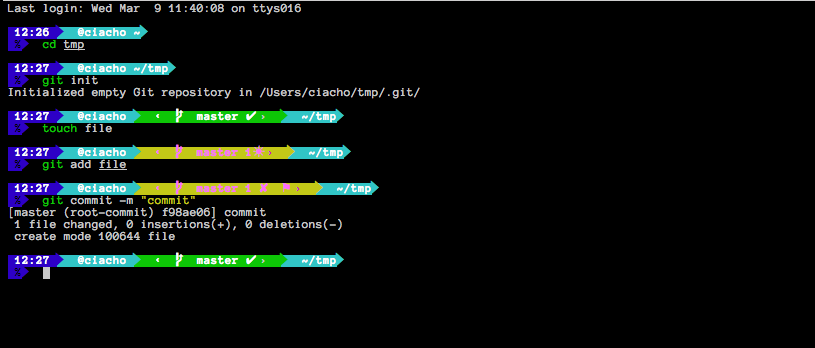

# ciacho-ohmyzsh-theme

	

Ciacho is [oh-my-zsh shell](https://github.com/robbyrussell/oh-my-zsh) theme based on the [Powerline Vim plugin](https://github.com/Lokaltog/vim-powerline) & [Agnoster Theme](https://gist.github.com/agnoster/3712874) & [Agnoterzak Theme](https://github.com/zakaziko99/agnosterzak-ohmyzsh-theme)

It currently shows:

Battery Life (in case of the laptop is not charging)
Timestamp
Current directory
Git status
User & Host status

## How To Install

Put file ciacho.zsh-theme into ~/.oh-my-zsh/custom
 

### Changelog

1.1a 
 - some changes

0.3b
 - update dir - Cut off more than 45 characters

0.3c
 - change displayed colors on username (different colors on root, ssh
   client, root on OSX)

